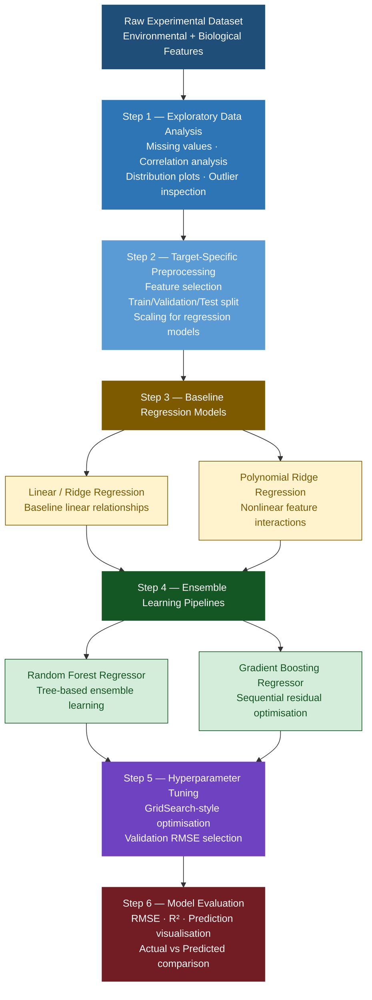

# Bacterial Growth Regression using Machine Learning
### End-to-end Regression Pipelines for Predicting Bacterial Growth Dynamics

[](https://python.org)
[](https://scikit-learn.org)
[](https://pandas.pydata.org)
[](https://numpy.org)
[](https://matplotlib.org)

---

# Overview

This project explores the use of **machine learning regression pipelines**
to predict bacterial growth behaviour under varying environmental conditions.

Using experimental biological data, the models predict four important growth parameters:

- **a** → Maximum bacteria population reached
- **μ (mu)** → Growth rate of bacteria
- **τ (tau)** → Delay before growth begins
- **a₀** → Initial bacteria level

The project investigates:
- Exploratory Data Analysis (EDA)
- Target-specific preprocessing
- Multiple regression pipelines
- Hyperparameter optimisation
- Comparative evaluation using RMSE and R²

The goal was to build **robust, reproducible, and interpretable regression pipelines**
capable of modelling nonlinear biological growth dynamics.

---

# Results

## Final Tuned Model Performance

| Target | Model | Test RMSE | Test R² |
|---|---|---|---|
| **a** | Random Forest | **2.3262** | **0.9712** |
| **μ (mu)** | Random Forest | **1.7178** | **0.9706** |
| **τ (tau)** | Gradient Boosting | **0.0333** | **0.9939** |
| **a₀** | Random Forest | **0.0094** | **0.7014** |

---

## Baseline vs Tuned Performance

| Target | Model | Baseline R² | Tuned R² |
|---|---|---|---|
| a | Polynomial Ridge | 0.5405 | **0.7191** |
| a | Gradient Boosting | 0.9599 | **0.9681** |
| μ | Gradient Boosting | 0.9526 | **0.9667** |
| τ | Gradient Boosting | 0.9889 | **0.9939** |
| a₀ | Random Forest | 0.6969 | **0.7014** |

> Ensemble methods significantly outperformed linear baselines, highlighting
> strong nonlinear relationships in bacterial growth behaviour.

---

# Project Pipeline



---

# Key Technical Highlights

- Designed **16 independent regression pipelines**
  (4 models × 4 target variables)

- Implemented **target-specific preprocessing**
  to prevent data leakage between biological growth parameters

- Compared:
  - Ridge Regression
  - Polynomial Ridge Regression
  - Random Forest Regressor
  - Gradient Boosting Regressor

- Applied **manual hyperparameter optimisation**
  using validation-set RMSE minimisation

- Built separate preprocessing and tuning workflows
  for each target variable (`a`, `μ`, `τ`, `a₀`)

- Demonstrated that **ensemble learning methods**
  capture nonlinear biological relationships more effectively
  than traditional linear regression approaches

- Achieved **R² > 0.97**
  for multiple bacterial growth parameters

---

# Evaluation Metrics

The following regression metrics were used:

| Metric | Purpose |
|---|---|
| **RMSE** | Measures average prediction error magnitude |
| **R² Score** | Measures proportion of variance explained |

### Why these metrics?

- **RMSE** penalises large prediction errors and is highly interpretable
  in the original target scale.

- **R²** provides a normalised measure of explanatory power,
  allowing comparison across models.

Together, these metrics provide both:
- error-based evaluation
- goodness-of-fit evaluation

---

# Key Findings

- Ensemble methods consistently outperformed linear models
  across most target variables.

- Strong correlations between environmental conditions and
  bacterial growth parameters suggest complex nonlinear behaviour.

- Polynomial regression improved performance over standard linear regression,
  indicating meaningful interaction effects between features.

- Random Forest achieved the most stable performance overall,
  while Gradient Boosting produced the highest performance for `τ`.

- The target variable `a₀` was substantially harder to predict,
  suggesting weaker relationships with available experimental features.

---

# Tech Stack

| Category | Tools |
|---|---|
| Programming | Python 3.10 |
| Machine Learning | Scikit-learn |
| Data Processing | Pandas, NumPy |
| Visualisation | Matplotlib, Seaborn |
| Modelling | Ridge, Polynomial Regression |
| Ensemble Learning | Random Forest, Gradient Boosting |
| Environment | Jupyter Notebook / Google Colab |

---

# Installation

```bash
git clone https://github.com/YOUR_USERNAME/bacterial-growth-regression.git

cd bacterial-growth-regression

pip install -r requirements.txt
```

---

# Dataset

The dataset contains bacterial growth experiments performed under varying:

- CO₂ availability
- Light conditions
- Initial cyanobacteria concentration
- Sucrose production efficiency

The dataset includes the following target variables:

- `a`
- `μ (mu)`
- `τ (tau)`
- `a₀`

Due to dataset ownership restrictions,
the raw CSV file is not included in this repository.

---

# References

```bibtex
@article{yalcin2025mesophilic,
  title={Development of prediction software to describe total mesophilic bacteria in spinach using a machine learning-based regression approach},
  author={Yildirim-Yalcin, M and Yucel, O and Tarlak, F},
  journal={Food Science and Technology International},
  volume={31},
  number={1},
  pages={3--10},
  year={2025}
}

@article{tarlak2024pseudomonas,
  title={Machine Learning-Based Software for Predicting Pseudomonas spp. Growth Dynamics in Culture Media},
  author={Tarlak, F},
  journal={Life},
  year={2024}
}
```

---

# Author
**AJ**  

**AJ**  
Machine Learning • Data Science • AI Engineering
